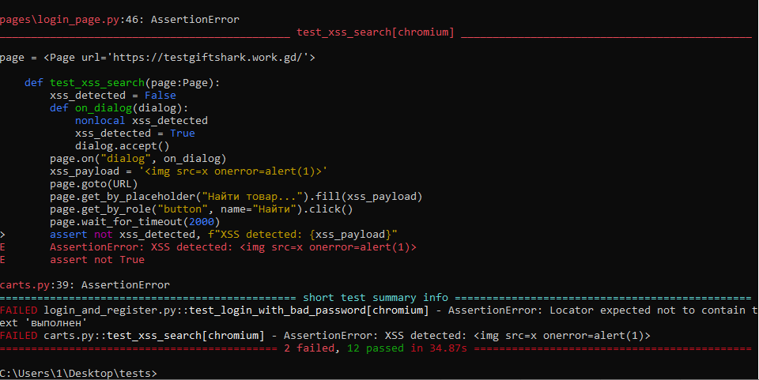
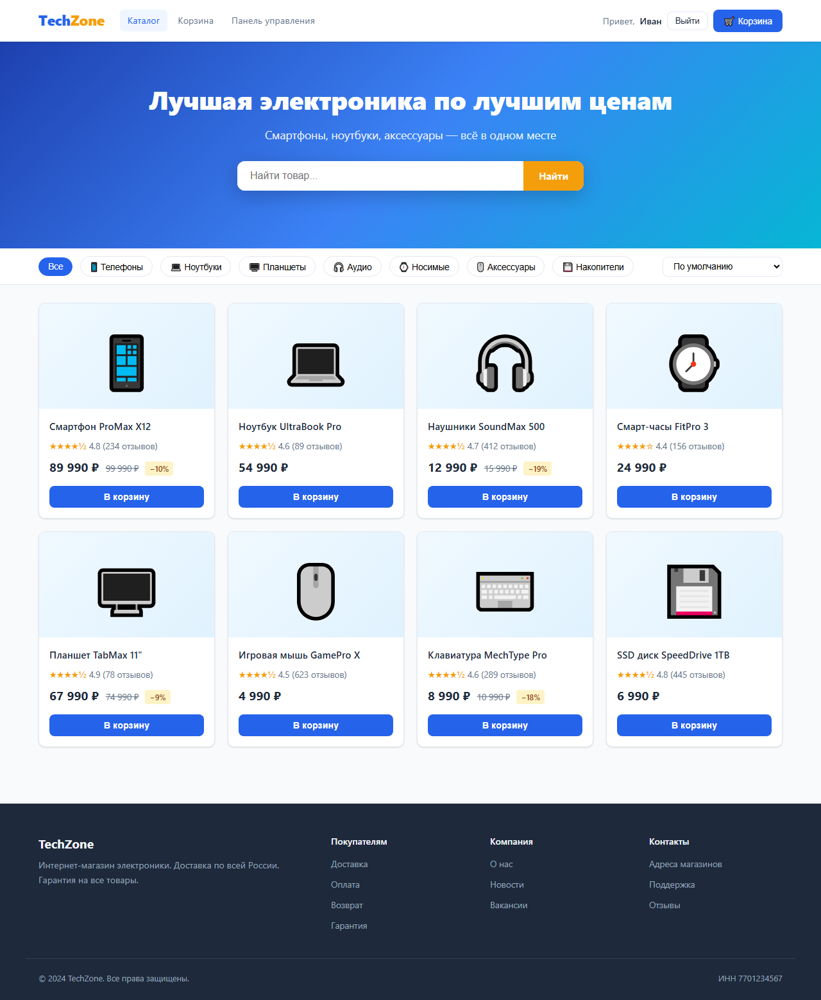
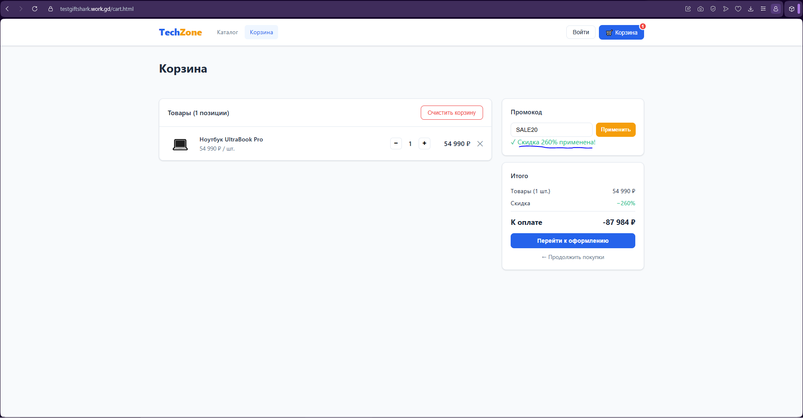
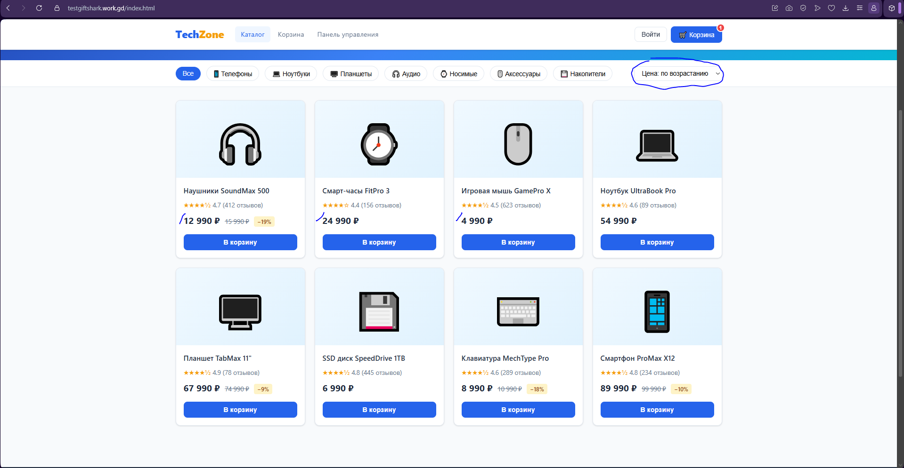
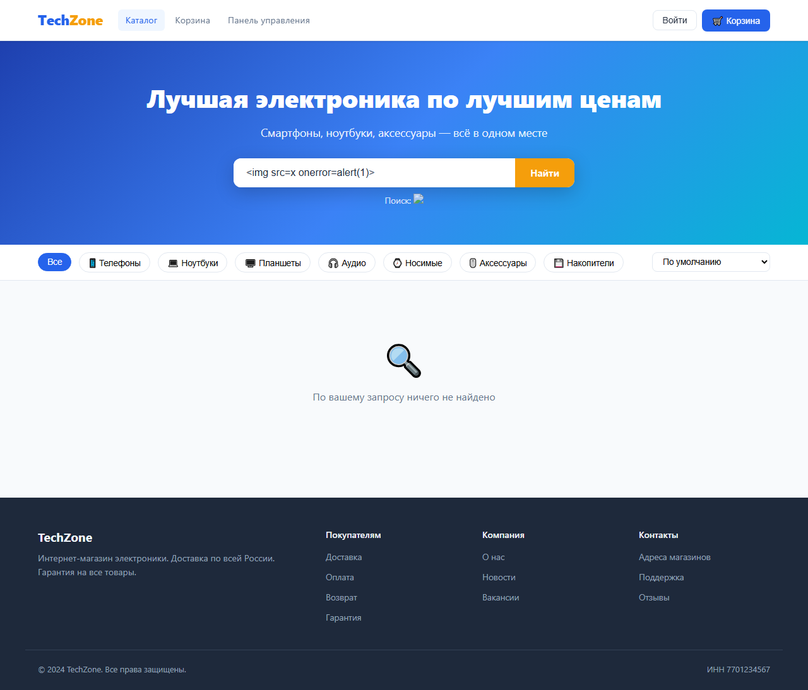
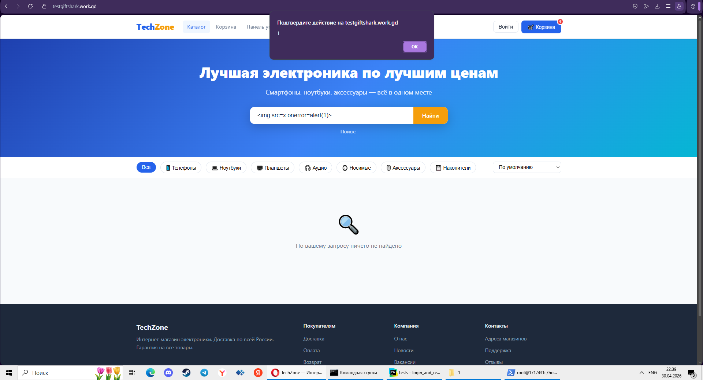

# TechZone — QA Portfolio

Это учебный проект для практики тестирования. Приложение TechZone — интернет-магазин электроники, сгенерированный нейросетью специально для того, чтобы было что тестировать. Баги в нём настоящие, я их нашёл сам в процессе тестирования.

Сайт: https://testgiftshark.work.gd  
Тестировщик: Тухватуллин Амиль  
Апрель 2026

---

## Что есть в репо

| | |
|---|---|
| [tests/](tests/) | Playwright автотесты на Python |
| [postman/](postman/) | Postman коллекция, 17 запросов |
| [bug-reports/](bug-reports/) | 15 баг-репортов |
| [screenshots/](screenshots/) | скриншоты к багам |
| [Google Sheets](https://docs.google.com/spreadsheets/d/1xFaQke6EBWmNIaCZDGZdy9gPBmojIhXRa3gY3Bf4wFk/edit) | тест-кейсы, чек-листы, матрица трассировки |

---

## Автотесты

Python + Playwright + pytest. Архитектура POM, есть BasePage. При падении теста conftest автоматически делает скриншот страницы.

```
tests/
├── pages/
│   ├── base_page.py         # базовые методы: open, click, fill
│   └── login_page.py        # локаторы и действия для страницы входа
├── conftest.py              # фикстура логина + хук скриншотов
├── test_auth.py             # вход и регистрация (4 теста)
└── test_search_and_cart.py  # поиск, корзина, XSS (3 теста)
```

Что покрыто:
- вход с правильными данными
- вход с неверным паролем — ловим BUG-001
- регистрация с рандомным email
- регистрация без email
- поиск по 8 товарам (parametrize)
- добавление товара в корзину
- XSS в поле поиска — ловим BUG-014

Запуск:

```bash
pip install -r requirements.txt
playwright install chromium

pytest        # все тесты
pytest -v     # с подробным выводом
```

Результаты:



---

## Postman

[postman/TechZone_API.postman_collection.json](postman/TechZone_API.postman_collection.json)

17 запросов: Auth (4), Products (4), Cart (5), Orders (4). В каждом pm.test() на статус-код, поля ответа и граничные значения.

Импорт: Postman → Import → выбрать файл.

---

## Баги

Нашёл 15 штук. Четыре из них критичные — вход с любым паролем и две XSS-уязвимости.

| ID | что сломано | P | S |
|---|---|---|---|
| BUG-001 | вход с любым паролем | P1 | S1 |
| BUG-002 | неверная сумма при кол-во > 1 | P1 | S2 |
| BUG-003 | заказ оформляется без адреса | P1 | S2 |
| BUG-004 | пароль виден открытым текстом | P2 | S2 |
| BUG-005 | промокод применяется бесконечно, сумма уходит в минус | P2 | S2 |
| BUG-006 | поиск зависит от регистра | P2 | S3 |
| BUG-007 | двойной клик — товар добавляется дважды | P2 | S3 |
| BUG-008 | сортировка по цене строковая, не числовая | P3 | S3 |
| BUG-009 | количество товара уходит в минус | P2 | S3 |
| BUG-010 | корзина не чистится при выходе | P2 | S3 |
| BUG-011 | опечатка "Оформть" | P3 | S4 |
| BUG-012 | title вкладки корзины — "Главная" | P3 | S4 |
| BUG-013 | нет hover на кнопке очистки корзины | P3 | S4 |
| BUG-014 | XSS в строке поиска | P1 | S1 |
| BUG-015 | XSS в поле промокода | P1 | S1 |

Полные описания: [bug-reports/bug-reports.txt](bug-reports/bug-reports.txt)

---

## Скриншоты

BUG-001 — вход с неверным паролем проходит успешно:


BUG-005 — промокод применён несколько раз, скидка 260%, итог −87 984 ₽:


BUG-008 — сортировка по цене: 12 990 стоит перед 4 990:


BUG-014 — XSS-пейлоад выполнился в поиске:


BUG-015 — XSS через поле промокода:


---

## Тест-документация

[Google Sheets](https://docs.google.com/spreadsheets/d/1xFaQke6EBWmNIaCZDGZdy9gPBmojIhXRa3gY3Bf4wFk/edit)

- Матрица трассировки требований — 60 требований привязаны к тест-кейсам и багам
- Тест кейсы
- Чек лист
